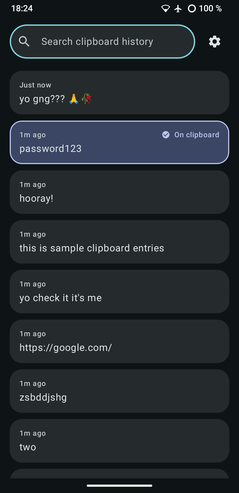
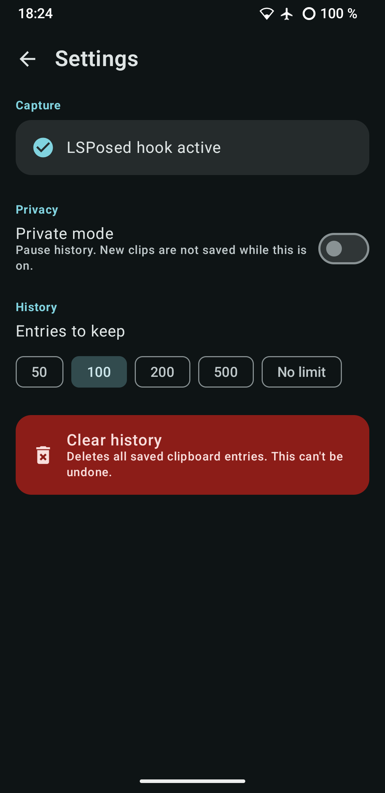

# ClipVault

[](https://github.com/kaduvert/AClipBoardManager/releases/latest/download/app-release.apk)
[](https://github.com/kaduvert/AClipBoardManager/releases/latest)

A minimal, single-screen, Material You clipboard manager for rooted / LSPosed
Android devices. No `READ_CLIPBOARD`-style runtime permission dance, no ads, no
cloud sync - it watches the system clipboard at a privileged level and keeps a
local, searchable history.

 

- **One screen**: a search field pinned at the top, and a scrolling list of
  past clips below it. Tap any entry to put it back on the clipboard - the
  entry that's actually live on the clipboard right now is visually marked.
  Tapping never creates a duplicate row.
- **One settings screen**: private mode (pause saving), how much history to
  keep, and a clear-history action.
- **No normal clipboard permissions used.** Capture happens either via an
  LSPosed module hook or via a privileged system service - see below.
- **One capture path per build, chosen when you compile it, not a switch in
  the app.** There used to be an in-app "use root capture service" toggle
  with both capture paths always compiled in; there isn't any more. See
  "Two builds, not one app with a switch" below.

## How capture actually works

Android has blocked background apps from reading clipboard *content* since
Android 10 (they can see that something changed, not what it says) unless
they're the focused app, the default keyboard, or hold the signature
permission `android.permission.READ_CLIPBOARD_IN_BACKGROUND`. ClipVault
never asks for foreground focus or IME access - instead, it's built one of
two different ways:

### Two builds, not one app with a switch

```
./gradlew assembleRelease                          # LSPosed build (default)
./gradlew assembleRelease -Pclipvault.useRoot=true  # root/priv-app build
```

`clipvault.useRoot` is a Gradle property, not a runtime setting - it decides
which of `app/src/xposed/` or `app/src/root/` gets added to the `main`
source set (java, manifest, resources, the lot) in `app/build.gradle.kts`.
Only one of the two is ever compiled into a given APK:

- **`clipvault.useRoot=false` (default): the LSPosed build.** No priv-app
  code, no foreground service, no boot receiver, no
  `READ_CLIPBOARD_IN_BACKGROUND` permission declaration - there's nothing in
  this APK a root module would ever need to touch. Install it normally.
- **`clipvault.useRoot=true`: the root/priv-app build.** No Xposed/LSPosed
  code, no `ContentProvider` IPC bridge, no `xposedmodule` manifest metadata,
  no Xposed API dependency. This build isn't meant to be installed
  normally - it's meant to be flashed in by `/module`, which places it
  straight into `/system/priv-app`. See `module/README.md`.

Within the LSPosed build, `clipvault.modernXposedHook` (default `true`) keeps
its original, narrower meaning: whether the modern libxposed-API entry point's
manifest (`META-INF/xposed/*`) is shipped alongside the classic rovo89-style
one, which is always shipped either way for framework compatibility. It has
no effect at all in the root build, since none of `app/src/xposed/` - modern
or classic - is even compiled in that build to begin with.

### Path 1 - LSPosed

`app/src/xposed/java/com/clipvault/app/xposed/ClipboardHook.kt` (and its
modern-API counterpart, `ClipboardHookModern.kt`) is loaded by LSPosed
straight into **system_server** (scope `android`, declared in
`assets/xposed_init` and `res/values/arrays.xml`). It hooks every
`setPrimaryClip(...)` overload it can find on
`com.android.server.clipboard.ClipboardService` (and any nested Binder-stub
class, to be resilient to AOSP/OEM differences), pulls the plain-text item out
of the `ClipData`, and hands it to the app through a small write-only
`ContentProvider` (`provider/ClipboardProvider.kt`). That provider is guarded
by a custom `signature`-level permission - only this app's own signature, or a
caller running as the SYSTEM uid (i.e. system_server itself), can write to it.

Because the hook lives inside system_server, it sees **every** clipboard write
on the device, from any app, regardless of focus - this is the same technique
long-standing Xposed-based clipboard tools have used.

**Setup:**
1. Build (`./gradlew assembleRelease`, no `useRoot` property) and install the
   app normally.
2. Open LSPosed Manager, enable the **ClipVault** module.
3. Under the module's scope, make sure **Android System** (`android`) is
   ticked - it should be pre-selected from `xposedscope`.
4. Reboot.
5. Open ClipVault → Settings. The capture status card should read
   **"LSPosed hook active."**

### Path 2 - Root/priv-app, no LSPosed (`/module`)

The root build's `root/ClipboardWatcherService.kt` is a normal in-app
`ClipboardManager.OnPrimaryClipChangedListener` running in a foreground
service - but that only receives real clipboard *content* in the background
if the app itself holds `READ_CLIPBOARD_IN_BACKGROUND`, which is a
`signature|privileged` permission normal apps can never be granted, root or
not (it can't be granted with `pm grant`, even as root - that only works for
dangerous/runtime permissions).

`/module` gets you there the way that permission class is actually meant to
be granted: by installing this build as a **privileged system app**,
allow-listed for that one permission, via a Magisk/KernelSU module -
systemlessly, no direct writes to `/system`. Unlike the old version of this
module, the compiled APK is baked into the zip itself (see
`module/build-module.sh`), so it's a single flash
and a single reboot - full details, including why the old approach needed
two reboots, are in `module/README.md`.

Once it's flashed and you've rebooted, there is nothing left to open or
toggle: the service starts itself on every boot (`root/BootCompletedReceiver.kt`),
and Settings just shows you whether the permission is actually granted.

**Caveats, stated plainly:** this path depends on your ROM's clipboard-service
implementation not deviating from AOSP in a way that breaks the priv-app
permission check, and heavily customized OEM skins (MIUI, One UI, etc.) are
more likely to do that than AOSP-based/GSI ROMs. LSPosed is the more reliable
of the two paths for exactly this reason - it doesn't depend on that
permission existing/working at all, since it reads the clip before any
permission check happens.

### Private mode & history limit

Both capture paths funnel into the same `ClipRepository.recordCapture()`,
which is where private mode (skip saving entirely) and the history limit
(oldest entries beyond the limit are trimmed) are enforced - so they behave
identically regardless of which build you're running.

## Building

Open the project root in Android Studio (Ladybug/Koala or newer) and let it
sync - it's a standard Gradle Kotlin DSL project, nothing exotic beyond the
`clipvault.useRoot` source-set switch described above. Or from the command
line, once you've let Android Studio generate the Gradle wrapper jar once
(or run `gradle wrapper` yourself with Gradle 8.9+ installed):

```
./gradlew assembleDebug                                  # LSPosed, debug
./gradlew assembleRelease                                # LSPosed, release
./gradlew assembleRelease -Pclipvault.useRoot=true        # root/priv-app, release
```

The debug build installs alongside a release build (`applicationIdSuffix
".debug"`) if you ever need both side by side. `clipvault.useRoot` applies to
debug builds too, for what it's worth, though there's rarely a reason to
debug-build the root flavor rather than just installing a release build via
`/module` directly.

Run a clean build (`./gradlew clean`) when switching `clipvault.useRoot`
between builds - it changes which source directories exist in the variant
entirely, and while Gradle should pick that up on its own, a clean build
costs little and removes any doubt.

- `compileSdk` / `targetSdk`: 35 (Android 15)
- `minSdk`: 26 (Android 8) - the UI and database work fine much further back
  than the capture mechanisms do; capture itself obviously needs LSPosed or
  root regardless of API level, and the root build specifically needs
  Android 10+ for `READ_CLIPBOARD_IN_BACKGROUND` to exist at all (see
  `module/README.md`).

## Project layout

```
app/src/main/java/com/clipvault/app/       common to both builds
├── ClipVaultApp.kt              application-level repository singleton;
│                                  calls capture/CaptureCoordinator's
│                                  onAppCreated() hook
├── MainActivity.kt              two-route NavHost (main, settings)
├── capture/CaptureStatus.kt     common status shape - see below
├── data/                        Room entity/DAO/DB, DataStore settings, repository
└── ui/                          Compose screens, view model, Material You theme

app/src/xposed/java/com/clipvault/app/     only in the LSPosed build
├── provider/ClipboardProvider.kt  write-only IPC bridge used by the hook
├── xposed/
│   ├── ClipboardHook.kt          classic-API system_server hook
│   ├── ClipboardHookModern.kt    modern-API (libxposed) system_server hook
│   ├── ClipCapture.kt           reflection helper shared by both hooks
│   └── HookStatus.kt            in-process marker so Settings can show real status
└── capture/CaptureCoordinator.kt  LSPosed-flavor status check (reads HookStatus)

app/src/root/java/com/clipvault/app/       only in the root/priv-app build
├── root/
│   ├── ClipboardWatcherService.kt  foreground service, no su/root at runtime
│   └── BootCompletedReceiver.kt    starts the service on every boot
└── capture/CaptureCoordinator.kt  root-flavor status check (checks the permission)

module/                          root-mode flash-once module (see module/README.md)
```

`capture/CaptureCoordinator` is the same class name and method signatures in
both `app/src/xposed` and `app/src/root`, with a different implementation in
each - common code (`SettingsScreen.kt`, `ClipVaultApp.kt`) calls it without
caring which flavor it's actually running in, since only one of the two ever
exists in a given build.

## What's intentionally not here

Per the brief, this stays extremely simple: no per-entry delete/pin, no image
or rich-content clips (plain text only), no cloud sync, no widgets. Search,
tap-to-activate, private mode, a history cap, and clear-all are the whole
feature set. As of this rewrite, that also includes no in-app way to switch
capture methods - that's a build-time choice now, not a feature.
